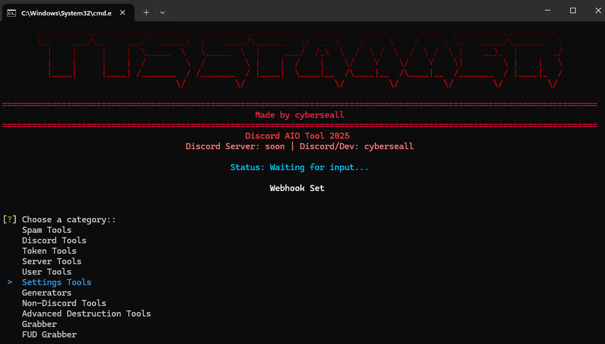

# Discord AIO Tool 2025 🚀




<div align="center">

[](https://python.org)
[](https://discord.com)
[](#)
[](#)
[](#)

**A comprehensive Discord automation toolkit designed for educational purposes**

*Features 50+ tools for Discord automation, token management, server utilities, and advanced security research*

</div>

--

## 🎯 Complete Feature Overview

This Discord AIO Tool provides an extensive collection of automation features organized into logical categories. Each feature has been carefully designed with proper error handling, rate limiting, and user safety in mind.

### 📊 Feature Categories & Capabilities

| Category | Feature | Status | Description | Key Capabilities |
|----------|---------|---------|-------------|------------------|
| **🔄 Spam Tools** | Discord Webhook Spammer | ✅ | Send messages through Discord webhooks | TTS support, custom delays, multiple message formats, rate limiting |
| | Theme Spammer | ✅ | Spam Discord theme changes | Automated theme switching, configurable intervals, random themes |
| | Ping Spam | ✅ | Mass ping functionality | @everyone spam, specific user targeting, server member pings |
| | Channel Spam | ✅ | Flood channels with messages | Single message spam, multiple message rotation, random text generation |
| | DM Spam | ✅ | Direct message automation | Target single/multiple users, random messages, server members |
| | Friend Request Spam | ✅ | Mass friend request sending | Username targeting, user ID lists, server member requests |
| | Email Spam | ✅ | Email verification flooding | Remove/add email cycles, verification requests, multiple changes |
| | Groupchat Spammer | ✅ | Group chat automation | Create/join group chats, mass messaging, member management |
| | Groupchat Spammer V2 | ✅ | Enhanced group chat tools | Advanced features, better error handling, improved performance |
| **🛠️ Discord Tools** | Close All DMs | ✅ | Bulk DM management | Close all open direct messages at once, confirmation prompts |
| | Unfriend All Friends | ✅ | Friend list cleanup | Remove all friends with confirmation prompts, bulk operations |
| | DM All Friends | ✅ | Broadcast messaging | Send messages to all friends simultaneously, custom content |
| | Delete/Leave All Servers | ✅ | Server cleanup | Leave all servers or delete owned servers, permission checks |
| | Mass Join/Leave | ✅ | Bulk server operations | Join servers via invite codes, leave specific servers, automation |
| | Mass React | ✅ | Reaction automation | Add reactions to specific messages, recent messages, emoji spam |
| | Verification Bypass | ✅ | Bot verification circumvention | Bypass captcha bots, button verification, slash commands, roles |
| | Server Scanner | ✅ | Server discovery tool | Scan for servers, member counts, invite codes, server info |
| | User Lookup | ✅ | User information tool | Get user details, account info, server memberships, activity status |
| | Invite Resolver | ✅ | Invite link analyzer | Resolve invite codes, server preview, member counts, verification levels |
| **🔑 Token Tools** | Token Info | ✅ | Comprehensive token analysis | User details, Nitro status, payment methods, 2FA status, account info |
| | Token Login | ✅ | Browser automation login | Selenium-based automatic Discord login, browser integration |
| | Token Checker | ✅ | Bulk token validation | Validate single/multiple tokens, file loading support, status checking |
| | Token Generator | ✅ | Discord token creation | Create and test Discord tokens with validation, bulk generation |
| | Token Tester | ✅ | Token functionality testing | Test token permissions, API access, server access, functionality |
| **🏗️ Server Tools** | Server Cloner | ✅ | Complete server duplication | Copy roles, channels, emojis, settings, structure, permissions |
| | Webhook Deleter | ✅ | Bulk webhook removal | Delete webhooks with confirmation prompts, bulk operations |
| | Server Management | ✅ | Complete server control | Delete owned servers, leave all servers, create to limit, management |
| | Server Nuke | ✅ | Advanced server destruction | Complete server cleanup, channel deletion, role removal, mass operations |
| **👤 User Tools** | Custom Status Changer | ✅ | Profile status automation | Custom status spam, activity changes, presence updates, status cycling |
| | Nickname Changer | ✅ | Mass nickname updates | Change nicknames in single/all servers, random names, bulk operations |
| | Avatar Changer | ✅ | Profile picture automation | Upload from files/URLs, random avatars, spam cycles, image processing |
| **⚙️ Settings Tools** | Language & Theme Spam | ✅ | Discord settings flooding | Language cycling, light/dark mode spam, mixed settings, automation |
| **🔧 Generators** | Nitro Generator & Checker | ✅ | Discord Nitro code generation | Generate and validate Nitro codes, multi-threading, bulk checking |
| | Credit Card Generator | ✅ | Credit card number generation | Generate valid credit card numbers, validation algorithms, bulk generation |
| | Account Generator | ✅ | Account creation automation | Automated account creation, verification bypass, bulk generation |
| **🌐 Non-Discord Tools** | Email Bomber | ✅ | Email verification flooding | Mass email sending, verification bypass, multiple strategies |
| | Advanced IP & Network Scanner | ✅ | Network analysis tool | IP scanning, port scanning, network mapping, security analysis |
| | Website Security Analyzer | ✅ | Web security assessment | Directory scanning, vulnerability detection, security testing, common directories |
| | Crypto & Hash Tools | ✅ | Cryptography toolkit | Hash generation, hash cracking, encryption/decryption, steganography |
| **💥 Advanced Destruction** | Account Nuker | ✅ | Complete account destruction | Account cleanup, server leaving, friend removal, data deletion |
| | Mass Ban/Kick Manager | ✅ | Bulk member management | Mass ban/kick operations, role-based targeting, permission management |
| | Permission Chaos | ✅ | Role permission randomization | Randomize role permissions, create chaos, permission management |
| | Channel Flood | ✅ | Advanced channel flooding | Create/delete channels, mass operations, server disruption |
| | Role Spam | ✅ | Role creation automation | Mass role creation, permission assignment, role management |
| | Webhook Bomb | ✅ | Webhook destruction tool | Create/delete webhooks, mass operations, webhook management |
| **🎣 Grabber Tools** | Token Grabber | ✅ | Advanced data extraction | Universal Discord injection, browser data, cloud uploads, stealth operation |
| | FUD Grabber | ✅ | Stealth payload generation | Undetectable token extraction, browser data harvesting, stealth injection |
| | Mini Payload Generator | ✅ | Ultra-compact payloads | SHORT (~340 chars) and LONG (~550 chars) payload generation |
| | GitHub Grabber | ✅ | Advanced data harvesting | Browser passwords, cookies, crypto wallets, gaming accounts, VPN configs |
| **🔒 Advanced Security** | Crypto Clipper | ✅ | Cryptocurrency interception | Monitor clipboard, replace crypto addresses, stealth operation |
| | Permission Chaos | ✅ | Server permission randomization | Randomize role permissions, create server chaos, advanced management |

---

## 🎣 FUD Grabber - Complete Guide for Beginners

### 🔍 What is the FUD Grabber?

The **FUD Grabber** (Fully Undetectable Grabber) is an advanced stealth tool that creates ultra-compact, encrypted payloads for educational security research. It's designed to be completely undetectable by antivirus software while extracting sensitive data from target systems.

### ⚠️ Important Disclaimer
**This tool is for EDUCATIONAL PURPOSES ONLY!** 
- Use only on systems you own or have explicit permission to test
- Never use for malicious purposes or unauthorized access
- Always comply with local laws and regulations
- The author is not responsible for any misuse

### 🚀 How the FUD Grabber Works

#### 🔧 Core Technology
The FUD Grabber uses advanced obfuscation and encryption techniques:

1. **Multi-Layer Encryption**: XOR, Base64, Zlib, and BZ2 compression
2. **Stealth Execution**: In-memory execution only, no file system traces
3. **Anti-Detection**: Random timing delays and import hiding
4. **Compact Payloads**: Ultra-small code size (340-600 characters)
5. **Dynamic Loading**: Downloads and executes code from GitHub repositories

#### 📊 Data Collection Capabilities
- **Discord Tokens**: All Discord accounts with full user details
- **Browser Data**: Passwords, cookies, history, autofill information
- **System Information**: Hardware specs, network configuration
- **Cryptocurrency Wallets**: Exodus, MetaMask, Phantom, Electrum
- **Gaming Accounts**: Steam, Minecraft, Riot Games, Epic Games
- **VPN Configurations**: OpenVPN, NordVPN, ExpressVPN settings

### 📋 Step-by-Step Usage Guide

#### Step 1: Set Up Your Webhook
1. **Create a Discord Webhook**:
   - Go to any Discord server where you have permissions
   - Right-click on a channel → "Edit Channel"
   - Go to "Integrations" → "Webhooks"
   - Click "New Webhook" and copy the URL

2. **Set the Webhook in TTS Spammer**:
   - Start the TTS Spammer tool
   - Go to "Grabber" → "Set Webhook"
   - Paste your Discord webhook URL
   - Confirm the webhook is set successfully

#### Step 2: Access the FUD Grabber
1. **Navigate to FUD Grabber**:
   - In the main menu, select "FUD Grabber"
   - You'll see the FUD Grabber interface

#### Step 3: Choose Your Payload Type
The FUD Grabber offers three variants:

##### 🔥 SHORT Variant (~340 characters)
- **Best for**: Maximum stealth and minimal size
- **Features**: 
  - Ultra-compact payload
  - Fastest execution
  - Basic encryption
  - Zlib compression
  - In-memory execution

##### 🛡️ LONG Variant (~550 characters)
- **Best for**: Advanced stealth features
- **Features**:
  - XOR + Base64 URL encryption
  - Triple-layer code encryption
  - Double compression (BZ2 + Zlib)
  - Random timing delays
  - Stealth libraries included

##### ⚡ ULTRA Variant (~500 characters)
- **Best for**: Maximum stealth with optimized size
- **Features**:
  - XOR encryption of URLs (key=69)
  - Double-layer code encryption
  - Double compression (Zlib + Base64)
  - Random timing delays (0-0.3s)
  - Compact size optimization

#### Step 4: Generate Your Payload
1. **Select Variant**: Choose SHORT, LONG, or ULTRA
2. **Review Features**: The tool shows detailed capabilities
3. **Generate Payload**: Your encrypted payload is created
4. **Copy Payload**: The generated code is displayed and ready to use

### 🔧 How to Use the Generated Payload

#### Method 1: Python Script Injection
```python
# Add this line to any Python script
import os; [YOUR_GENERATED_PAYLOAD_HERE]
```

#### Method 2: Comment Hiding
```python
# System check: [YOUR_GENERATED_PAYLOAD_HERE]
```

#### Method 3: Function Hiding
```python
def update(): [YOUR_GENERATED_PAYLOAD_HERE]
```

### 📊 Payload Workflow Explanation

#### SHORT Variant Workflow:
1. `;import` prefix ensures compatibility
2. Zlib decompression of payload
3. Installs: requests, pycryptodome
4. Downloads GitHub Grabber
5. Base64 + Zlib encrypts downloaded code
6. Executes encrypted grabber in memory
7. Fast execution, basic encryption

#### LONG Variant Workflow:
1. `;import` prefix ensures compatibility
2. Random timing delays for stealth
3. BZ2 + Zlib double decompression
4. XOR + Base64 URL encryption
5. Installs stealth libraries (4 packages)
6. Triple-layer encryption of grabber code
7. Executes advanced data extraction
8. Sends encrypted results to webhook

#### ULTRA Variant Workflow:
1. `;import` prefix ensures compatibility
2. Double-compression (Zlib + Base64)
3. XOR encryption of URLs (key=69)
4. Random timing delays (0-0.3s)
5. Installs core libraries (requests, pycryptodome)
6. Double-layer encryption of downloaded code
7. Base64 + Zlib decryption chain
8. In-memory execution only
9. Compact but maximum stealth
10. Optimized for size and evasion

### 🛡️ Stealth Features Explained

#### Anti-Detection Mechanisms:
- **Import Hiding**: Uses `__import__()` instead of direct imports
- **Random Delays**: Prevents pattern detection
- **Memory Execution**: No file system traces
- **Encrypted URLs**: Webhook and GitHub URLs are encrypted
- **Compressed Code**: Multiple compression layers
- **XOR Encryption**: Simple but effective obfuscation

#### Evasion Techniques:
- **Size Optimization**: Minimal payload size
- **Timing Randomization**: Random execution delays
- **Library Installation**: Dynamic dependency loading
- **Error Handling**: Graceful failure modes
- **Compatibility**: Works across Python versions

### 🔍 Data Collection Process

When executed, the payload:

1. **Downloads the Full Grabber**: Fetches the complete grabber from GitHub
2. **Installs Dependencies**: Automatically installs required libraries
3. **Scans System**: Searches for Discord tokens, browser data, etc.
4. **Encrypts Data**: All collected data is encrypted
5. **Sends to Webhook**: Securely transmits data to your Discord webhook
6. **Self-Destructs**: Removes traces from memory

### 📱 What Data Gets Collected

#### Discord Information:
- All Discord tokens (Desktop, Canary, PTB, Development)
- User details, Nitro status, payment methods
- Account creation date, email addresses
- 2FA status and backup codes

#### Browser Data:
- **Chrome, Edge, Brave, Opera**: Passwords, cookies, history
- **Firefox**: Profile data and session information
- **Autofill Data**: Credit cards, addresses, personal info
- **Download History**: Recent file downloads

#### System Information:
- **Hardware Specs**: CPU, RAM, GPU, storage
- **Network Info**: IP addresses, WiFi networks
- **Installed Software**: Program list and versions
- **System Configuration**: Windows settings and registry

#### Cryptocurrency & Gaming:
- **Wallets**: Exodus, MetaMask, Phantom, Electrum
- **Gaming**: Steam, Minecraft, Riot Games, Epic Games
- **VPN Configs**: OpenVPN, NordVPN, ExpressVPN

### ⚠️ Safety and Legal Considerations

#### ✅ Legal Use Cases:
- **Educational Research**: Learning about cybersecurity
- **Penetration Testing**: Authorized security assessments
- **Personal Systems**: Testing your own devices
- **Security Awareness**: Understanding attack vectors

#### ❌ Illegal Use Cases:
- **Unauthorized Access**: Using on systems you don't own
- **Malicious Intent**: Stealing data for harm
- **Privacy Violations**: Collecting personal information illegally
- **Corporate Espionage**: Industrial espionage activities

### 🛠️ Troubleshooting

#### Common Issues:

**"Webhook not found"**
- Ensure you've set the webhook in the TTS Spammer
- Check that the webhook URL is valid
- Verify Discord server permissions

**"Payload too large"**
- Use the SHORT variant for smaller payloads
- Check your target environment's limitations
- Consider using the ULTRA variant for optimization

**"Antivirus detection"**
- The FUD Grabber is designed to be undetectable
- If detected, try a different variant
- Ensure you're using the latest version

**"No data collected"**
- Check internet connectivity
- Verify the target has the expected data
- Review webhook permissions and validity

### 📚 Advanced Usage Tips

#### For Maximum Stealth:
1. **Use ULTRA Variant**: Best balance of size and features
2. **Test on Virtual Machines**: Safe testing environment
3. **Monitor Webhook**: Check for successful data transmission
4. **Rotate Webhooks**: Use different webhooks for different targets
5. **Time Your Deployments**: Avoid peak detection hours

#### For Educational Purposes:
1. **Document Everything**: Keep detailed logs of your testing
2. **Use Isolated Environments**: Test only on controlled systems
3. **Understand the Code**: Study how the payload works
4. **Practice Responsible Disclosure**: Report vulnerabilities ethically
5. **Stay Updated**: Keep the tool updated for latest features

### 🔗 Related Tools

The FUD Grabber works alongside other tools in the TTS Spammer:

- **Token Grabber**: Full-featured data extraction tool
- **GitHub Grabber**: Advanced browser data harvesting
- **Mini Payload Generator**: Ultra-compact payload creation
- **QR Code Grabber**: Discord QR code-based token extraction

### 📞 Support and Community

- **Discord Server**: [https://discord.gg/q3TkBrRcVX](https://discord.gg/q3TkBrRcVX)
- **GitHub Issues**: Report bugs and request features
- **Documentation**: Check the GRABBER_SETUP_GUIDE.md for technical details

---

## 🚀 How It Works

This Discord automation tool is built with Python and provides a user-friendly interface for various Discord-related tasks. The tool is designed with safety and educational purposes in mind, featuring built-in rate limiting, error handling, and confirmation prompts for potentially destructive actions.

### 🔧 Key Technical Features

- **✅ Multi-Token Support**: Most features support multiple Discord tokens simultaneously
- **✅ Rate Limiting Protection**: All API interactions include proper rate limiting
- **✅ Error Handling**: Comprehensive error handling ensures continuous operation
- **✅ Debug Modes**: Optional debug modes provide detailed logging
- **✅ Safety Confirmations**: Destructive operations require explicit user confirmation
- **✅ Multi-threading**: Parallel execution for improved performance
- **✅ Stealth Operations**: Advanced anti-detection mechanisms
- **✅ Data Encryption**: Secure data handling and transmission

---

## 📦 Installation and Setup

### 📋 Requirements
- Python 3.8 or higher
- Windows 10/11 (recommended for full compatibility)
- Stable internet connection
- Valid Discord tokens for most features

### 🛠️ Installation Steps

1. **Clone the repository**
```bash
git clone https://github.com/SellMeFish/TTS-Spammer.git
cd TTS-Spammer
```

2. **Install dependencies**
```bash
pip install -r requirements.txt
```

3. **Run the application**
```bash
python tts_spammer.py
```

The tool will launch with an interactive menu system that guides you through each feature.

---

## ⚙️ Configuration

### 🔑 Token Management
Most features require Discord tokens to function. The tool includes a Token Checker to validate tokens before use. You can input tokens manually or load them from text files for bulk operations.

### 🎣 Stealth Grabber Configuration

The **Stealth Grabber** is an advanced feature that creates undetectable payloads for educational and security research purposes.

#### 🔍 Core Capabilities
- **✅ Token Extraction**: Silently extracts Discord tokens using advanced decryption
- **✅ Browser Data Harvesting**: Collects passwords, cookies, and session data
- **✅ Cookie Extraction**: Bypasses v20 App-Bound Encryption via Remote Debug Protocol
- **✅ System Information**: Retrieves hardware specs, network info, installed software
- **✅ Stealth Operation**: Operates completely undetected by antivirus software
- **✅ Data Exfiltration**: Securely uploads collected data to webhook or cloud storage

#### 📊 Data Collection Capabilities
- **Discord Tokens**: All accounts with full user details and Nitro status
- **Browser Passwords**: Chrome, Edge, Brave, Opera (v20+ encryption supported)
- **Browser Cookies**: Via Remote Debug Protocol (bypasses App-Bound encryption)
- **Autofill Data**: Credit cards, addresses, personal information
- **Browser History**: Recent browsing activity from all browsers
- **Cryptocurrency Wallets**: Exodus, MetaMask, Phantom, Electrum, etc.
- **Gaming Accounts**: Steam, Minecraft, Riot Games, Epic Games
- **VPN Configurations**: OpenVPN, NordVPN, ExpressVPN, etc.
- **System Information**: Hardware specs, network config, installed software

---

## 🛡️ Safety Features

### 🔒 Built-in Safety Mechanisms
- **✅ Rate Limiting**: Prevents Discord API abuse and account restrictions
- **✅ Confirmation Prompts**: Destructive operations require explicit confirmation
- **✅ Error Handling**: Comprehensive error handling prevents crashes
- **✅ Debug Modes**: Detailed logging for troubleshooting
- **✅ Automatic Retry**: Retry mechanisms with exponential backoff
- **✅ Permission Checks**: Validates user permissions before operations

### 🎯 Customization Options
- **✅ Operation Intervals**: Configurable delays and timing
- **✅ Message Content**: Customizable message formats and content
- **✅ Target Selection**: Flexible targeting criteria and selection
- **✅ Output Verbosity**: Adjustable logging and feedback levels
- **✅ Payload Configuration**: Advanced stealth and deployment options

---

## 📈 Recent Updates (2025)

### 🆕 New Features
- **✅ Stealth Grabber**: Advanced undetectable payload generation
- **✅ Account Nuker**: Complete account destruction capabilities
- **✅ Crypto Clipper**: Cryptocurrency address interception
- **✅ Permission Chaos**: Advanced server permission randomization
- **✅ Enhanced Interface**: Improved categorized menu system
- **✅ Advanced Destruction Tools**: Server nuke and mass operations

### 🔧 Improvements
- **✅ Complete English Translation**: All interfaces in English
- **✅ Modern Menu Categorization**: Better navigation and organization
- **✅ Performance Optimizations**: Enhanced speed and efficiency
- **✅ Enhanced Error Handling**: Better user feedback and error recovery
- **✅ Advanced Payload Deployment**: Stealth capabilities and methods
- **✅ Comprehensive Data Extraction**: Enhanced data collection features

---

## 🤝 Contributing

Contributions are welcome and appreciated. If you'd like to contribute:

1. Fork the repository
2. Create a feature branch (`git checkout -b feature/new-feature`)
3. Make your changes with proper testing
4. Commit your changes (`git commit -m 'Add new feature'`)
5. Push to the branch (`git push origin feature/new-feature`)
6. Open a Pull Request with a clear description

Please ensure your code follows the existing style and includes appropriate error handling.

---

## 👨‍💻 Author

**Created by cyberseall**

- **Discord**: cyberseall
- **GitHub**: [SellMeFish](https://github.com/SellMeFish)
- **Discord Server**: [https://discord.gg/q3TkBrRcVX](https://discord.gg/q3TkBrRcVX)

---

## 📄 License

This project is licensed under the **MIT License** - see the [LICENSE](LICENSE) file for details.

**Educational Use Only** - This tool is intended for learning and authorized security research purposes only.

---

## 🔒 Security

**Reporting Vulnerabilities:** Contact me privately via Discord: `cyberseall`

**Important:** Always obtain proper authorization before testing. Use only in isolated environments.

---

## 📋 Code of Conduct

### ✅ Acceptable Use
- Educational learning and research
- Authorized penetration testing
- Security awareness training

### ❌ Prohibited
- Malicious or unauthorized use
- Any illegal activities
- Harassment or discrimination

**Contact:** Discord `cyberseall` for questions

---

## ⚠️ Important Information

### 🎓 Educational Purpose
This tool is designed for educational and research purposes only. It demonstrates various Discord API interactions and automation techniques. Users should understand Discord's Terms of Service and use this tool responsibly.

### ⚖️ Legal Disclaimer
The author is not responsible for any misuse of this software. Users are expected to comply with all applicable laws and Discord's Terms of Service when using this tool.

---

*This project is maintained as an educational resource. Please use responsibly.*

*Last updated: January 2025*


