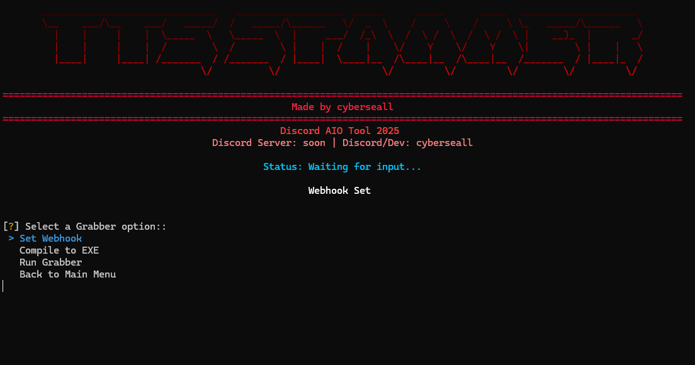

# Discord AIO Tool 2025



<div align="center">

[](https://python.org)
[](https://discord.com)
[](#)
[](#)

**A comprehensive Discord automation toolkit designed for educational purposes**

*Features 27+ tools for Discord automation, token management, and server utilities*

</div>

---

## Complete Feature List

This tool provides a wide range of Discord automation features organized into logical categories. Each feature has been carefully designed with proper error handling, rate limiting, and user safety in mind.

| Category | Feature | Description | Key Capabilities |
|----------|---------|-------------|------------------|
| **Spam Tools** | Webhook Spammer | Send messages through Discord webhooks | TTS support, custom delays, multiple message formats |
| | Theme Spammer | Spam Discord theme changes | Automated theme switching with configurable intervals |
| | Ping Spam | Mass ping functionality | @everyone spam, specific user targeting, server member pings |
| | Channel Spam | Flood channels with messages | Single message spam, multiple message rotation, random text |
| | DM Spam | Direct message automation | Target single/multiple users, random messages, server members |
| | Friend Request Spam | Mass friend request sending | Username targeting, user ID lists, server member requests |
| | Email Spam | Email verification flooding | Remove/add email cycles, verification requests, multiple changes |
| **Discord Tools** | Close All DMs | Bulk DM management | Close all open direct messages at once |
| | Unfriend All Friends | Friend list cleanup | Remove all friends with confirmation prompts |
| | DM All Friends | Broadcast messaging | Send messages to all friends simultaneously |
| | Delete/Leave All Servers | Server cleanup | Leave all servers or delete owned servers |
| | Mass Join/Leave | Bulk server operations | Join servers via invite codes, leave specific servers |
| | Mass React | Reaction automation | Add reactions to specific messages or recent messages |
| | Verification Bypass | Bot verification circumvention | Bypass captcha bots, button verification, slash commands, roles |
| **Token Tools** | Token Info | Comprehensive token analysis | User details, Nitro status, payment methods, 2FA status |
| | Token Login | Browser automation login | Selenium-based automatic Discord login |
| | Token Checker | Bulk token validation | Validate single/multiple tokens, file loading support |
| **Server Tools** | Server Cloner | Complete server duplication | Copy roles, channels, emojis, settings, and structure |
| | Webhook Deleter | Bulk webhook removal | Delete webhooks with confirmation prompts |
| | Server Management | Complete server control | Delete owned servers, leave all servers, create to limit |
| **User Tools** | Custom Status Changer | Profile status automation | Custom status spam, activity changes, presence updates |
| | Nickname Changer | Mass nickname updates | Change nicknames in single/all servers, random names |
| | Avatar Changer | Profile picture automation | Upload from files/URLs, random avatars, spam cycles |
| **Settings Tools** | Language & Theme Spam | Discord settings flooding | Language cycling, light/dark mode spam, mixed settings |
| **Generators** | Nitro Generator | Discord Nitro code generation | Generate and validate Nitro codes with multi-threading |
| | Token Generator | Discord token creation | Create and test Discord tokens with validation |
| **Advanced** | Token Grabber | Advanced data extraction | Universal Discord injection, browser data, cloud uploads |

## How It Works

This Discord automation tool is built with Python and provides a user-friendly interface for various Discord-related tasks. The tool is designed with safety and educational purposes in mind, featuring built-in rate limiting, error handling, and confirmation prompts for potentially destructive actions.

### Key Technical Features

**Multi-Token Support**: Most features support multiple Discord tokens simultaneously, allowing for efficient bulk operations across different accounts.

**Rate Limiting Protection**: All API interactions include proper rate limiting to prevent Discord API abuse and account restrictions.

**Error Handling**: Comprehensive error handling ensures the tool continues operating even when individual operations fail.

**Debug Modes**: Optional debug modes provide detailed logging for troubleshooting and understanding API interactions.

**Safety Confirmations**: Destructive operations require explicit user confirmation to prevent accidental data loss.

## Installation and Setup

### Requirements
- Python 3.8 or higher
- Windows 10/11 (recommended for full compatibility)
- Stable internet connection
- Valid Discord tokens for most features

### Installation Steps

1. **Clone the repository**
```bash
git clone https://github.com/SellMeFish/TTS-Spammer.git
cd TTS-Spammer
```

2. **Install dependencies**
```bash
pip install -r requirements.txt
```

3. **Run the application**
```bash
python tts_spammer.py
```

The tool will launch with an interactive menu system that guides you through each feature.

## Configuration

### Token Management
Most features require Discord tokens to function. The tool includes a Token Checker to validate tokens before use. You can input tokens manually or load them from text files for bulk operations.

### Safety Settings
The tool includes several safety mechanisms:
- Confirmation prompts for destructive actions
- Rate limiting to prevent API abuse
- Error handling to prevent crashes
- Debug modes for troubleshooting

### Customization
Many features allow customization of:
- Operation intervals and delays
- Message content and formats
- Target selection criteria
- Output verbosity levels

## Important Information

### Educational Purpose
This tool is designed for educational and research purposes only. It demonstrates various Discord API interactions and automation techniques. Users should understand Discord's Terms of Service and use this tool responsibly.

### Legal Disclaimer
The author is not responsible for any misuse of this software. Users are expected to comply with all applicable laws and Discord's Terms of Service when using this tool.

### Safety Features
The tool includes several built-in safety mechanisms:
- Rate limiting to prevent API abuse
- Comprehensive error handling
- Debug modes for troubleshooting
- Confirmation prompts for potentially destructive actions
- Automatic retry mechanisms with backoff

## Recent Updates (2025)

### New Features
- **Verification Bypass**: Advanced methods to bypass Discord bot verification systems
- **Server Management**: Complete server control including deletion, leaving, and creation
- **Email Spam**: Email verification flooding with multiple strategies
- **Settings Spam**: Automated Discord settings manipulation
- **Enhanced Interface**: Improved categorized menu system

### Improvements
- Complete English translation of all interfaces
- Modern menu categorization for better navigation
- Performance optimizations across all features
- Enhanced error handling and user feedback
- Better user experience with clearer instructions

## Contributing

Contributions are welcome and appreciated. If you'd like to contribute:

1. Fork the repository
2. Create a feature branch (`git checkout -b feature/new-feature`)
3. Make your changes with proper testing
4. Commit your changes (`git commit -m 'Add new feature'`)
5. Push to the branch (`git push origin feature/new-feature`)
6. Open a Pull Request with a clear description

Please ensure your code follows the existing style and includes appropriate error handling.

## Author

**Created by cyberseall**

- Discord: cyberseall
- GitHub: [SellMeFish](https://github.com/SellMeFish)
- Discord Server: Coming Soon

---

*This project is maintained as an educational resource. Please use responsibly.*

*Last updated: June 2025*
